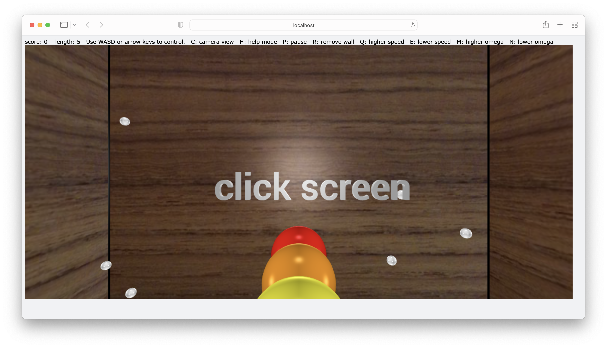

### Preparation

Install **vpython** before running the program.

```bash
pip3 install vpython
```

### Start playing

All the operations are written on the window, just easily run the program.

```bash
python3 main.py
```

The parameter you can tune are at the top of the code, feel free to modify them and enjoy the game.

For those who are not familiar with vpython, you can scroll to zoom in/out, and right-drag to move the camera. Note that these two operations are only allowed in "fix" camera mode.

### Screenshot




